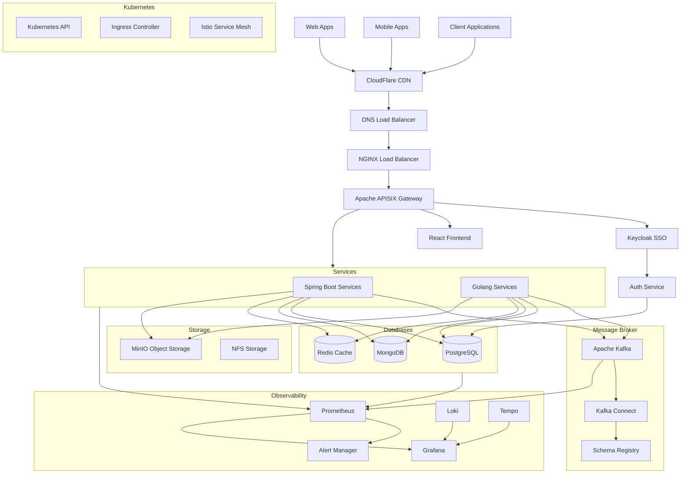

# System Components Installation Roadmap 🗺️

## Prerequisites Checklist ✅

1. Infrastructure Requirements:
   - Minimum 3 nodes for Kubernetes cluster
   - Each node: 4 CPUs, 16GB RAM minimum
   - At least 100GB storage per node
   - Load balancer for Kubernetes API server
   - Domain name and SSL certificates

2. Required Tools:
```bash
# Install required CLI tools
sudo apt update && sudo apt install -y \
    kubectl \
    helm \
    docker \
    git \
    jq \
    curl \
    apache2-utils

# Install kubectx and kubens for easier cluster management
sudo apt install kubectx
```

## Phase 1: Core Infrastructure 🏗️

### 1. Kubernetes Cluster Setup
```bash
# Create cluster (using your preferred method - example with kubeadm)
kubeadm init --control-plane-endpoint="YOUR_LOAD_BALANCER:6443" \
    --upload-certs \
    --pod-network-cidr=192.168.0.0/16

# Install Container Network Interface (CNI)
kubectl apply -f https://docs.projectcalico.org/manifests/calico.yaml

# Verify cluster health
kubectl get nodes
kubectl get pods -A
```

### 2. Storage Setup
```bash
# Install Storage Class (example with AWS EBS)
kubectl apply -f storage-class.yaml

# Verify storage class
kubectl get sc
```

### 3. Namespaces Creation
```bash
# Create all required namespaces
kubectl create namespace monitoring
kubectl create namespace logging
kubectl create namespace apps
kubectl create namespace kafka
kubectl create namespace storage
kubectl create namespace ingress-nginx
```

## Phase 2: Basic Services 🌐

### 1. NGINX Ingress Controller
```bash
# Add NGINX repository
helm repo add ingress-nginx https://kubernetes.github.io/ingress-nginx
helm repo update

# Install NGINX Ingress
helm install ingress-nginx ingress-nginx/ingress-nginx \
    --namespace ingress-nginx \
    --set controller.replicaCount=2
```

### 2. Cert Manager
```bash
# Install cert-manager
helm repo add jetstack https://charts.jetstack.io
helm repo update

helm install cert-manager jetstack/cert-manager \
    --namespace cert-manager \
    --create-namespace \
    --set installCRDs=true
```

## Phase 3: Monitoring Stack 📊

### 1. Prometheus Stack
```bash
# Add Prometheus repository
helm repo add prometheus-community https://prometheus-community.github.io/helm-charts
helm repo update

# Install Prometheus Stack
helm install monitoring prometheus-community/kube-prometheus-stack \
    --namespace monitoring \
    --values prometheus-values.yaml
```

### 2. Grafana
```bash
# Add Grafana repository
helm repo add grafana https://grafana.github.io/helm-charts
helm repo update

# Install Grafana
helm install grafana grafana/grafana \
    --namespace monitoring \
    --values grafana-values.yaml
```

### 3. Logging Stack
```bash
# Install Loki stack
helm install loki grafana/loki-stack \
    --namespace logging \
    --values loki-values.yaml
```

## Phase 4: Security and Authentication 🔒

### 1. Keycloak for SSO
```bash
# Add Bitnami repository
helm repo add bitnami https://charts.bitnami.com/bitnami
helm repo update

# Install Keycloak
helm install keycloak bitnami/keycloak \
    --namespace apps \
    --values keycloak-values.yaml
```

### 2. Vault for Secrets
```bash
# Add HashiCorp repository
helm repo add hashicorp https://helm.releases.hashicorp.com
helm repo update

# Install Vault
helm install vault hashicorp/vault \
    --namespace apps \
    --values vault-values.yaml
```

## Phase 5: Message Broker 📨

### 1. Kafka Setup
```bash
# Add Strimzi repository
helm repo add strimzi https://strimzi.io/charts/
helm repo update

# Install Strimzi Operator
helm install kafka-operator strimzi/strimzi-kafka-operator \
    --namespace kafka

# Deploy Kafka Cluster
kubectl apply -f kafka-cluster.yaml -n kafka
```

### 2. Schema Registry
```bash
# Install Confluent Schema Registry
helm install schema-registry confluent/schema-registry \
    --namespace kafka \
    --values schema-registry-values.yaml
```

## Phase 6: Databases 💾

### 1. PostgreSQL
```bash
helm install postgresql bitnami/postgresql \
    --namespace apps \
    --values postgresql-values.yaml
```

### 2. MongoDB
```bash
helm install mongodb bitnami/mongodb \
    --namespace apps \
    --values mongodb-values.yaml
```

### 3. Redis
```bash
helm install redis bitnami/redis \
    --namespace apps \
    --values redis-values.yaml
```

## Phase 7: Object Storage 📦

### MinIO Installation
```bash
helm repo add minio https://charts.min.io/
helm repo update

helm install minio minio/minio \
    --namespace storage \
    --values minio-values.yaml
```

## Phase 8: API Gateway 🚪

### APISIX Installation
```bash
helm repo add apisix https://charts.apiseven.com
helm repo update

helm install apisix apisix/apisix \
    --namespace apps \
    --values apisix-values.yaml
```

## Phase 9: Application Deployment 🚀

### 1. Backend Services
```bash
# Deploy Spring Boot services
kubectl apply -f spring-boot-deployment.yaml

# Deploy Golang services
kubectl apply -f golang-deployment.yaml
```

### 2. Frontend Application
```bash
# Deploy React application
kubectl apply -f react-deployment.yaml
```

## Phase 10: Post-Installation Tasks ✔️

1. Verify all components:
```bash
# Check all pods
kubectl get pods --all-namespaces

# Check all services
kubectl get svc --all-namespaces

# Check ingress
kubectl get ingress --all-namespaces
```

2. Configure Monitoring:
   - Import Grafana dashboards
   - Set up alerting rules
   - Configure log retention policies

3. Security Checks:
   - Review RBAC permissions
   - Check network policies
   - Validate SSL/TLS configurations

4. Performance Testing:
   - Run load tests
   - Check resource utilization
   - Validate auto-scaling configurations

## Maintenance Tasks 🔧

1. Regular Updates:
```bash
# Update Helm repositories
helm repo update

# List outdated charts
helm list --all-namespaces | grep -v NAMESPACE
```

2. Backup Procedures:
```bash
# Backup etcd
ETCDCTL_API=3 etcdctl snapshot save snapshot.db

# Backup persistent volumes
velero backup create backup-name
```

3. Monitoring Checks:
```bash
# Check cluster health
kubectl get componentstatuses

# Check node resources
kubectl top nodes

# Check pod resources
kubectl top pods --all-namespaces
```

## Additional Resources 📚

- [Kubernetes Documentation](https://kubernetes.io/docs/)
- [Helm Hub](https://artifacthub.io/)
- [Prometheus Documentation](https://prometheus.io/docs/)
- [APISIX Documentation](https://apisix.apache.org/docs/)


